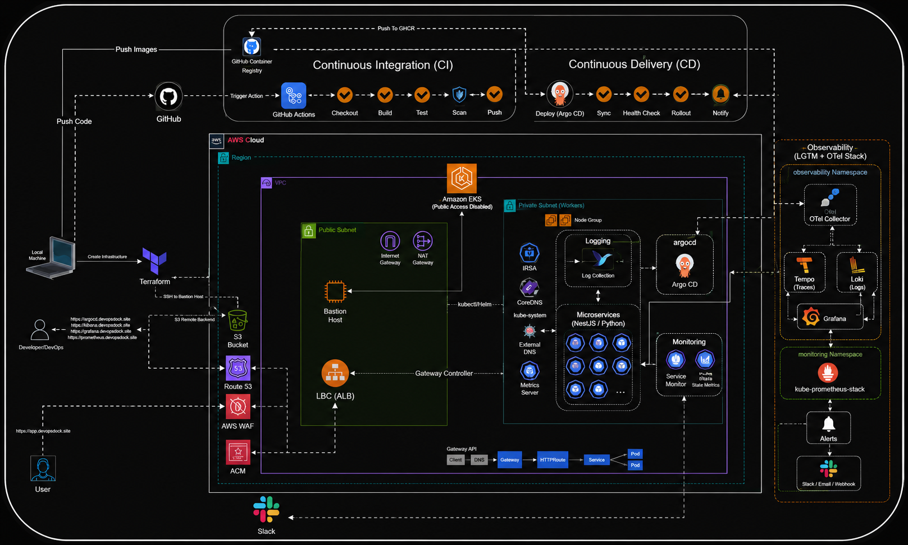
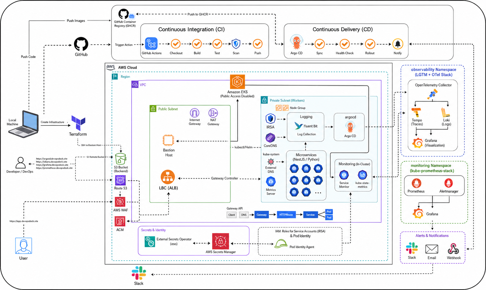

# Edulearn Platform

> A production-grade cloud-native learning platform built with **TypeScript, Go, Python, Kubernetes, GitOps, and AWS**.

This repository contains the **complete platform layer** for Edulearn: infrastructure provisioning, Kubernetes configuration, GitOps deployment, Helm packaging, observability, security, and application orchestration across multiple microservices.

The platform is designed using **microservices architecture**, **Clean Architecture**, **SOLID principles**, and a **GitOps-based deployment workflow** running on **Amazon EKS**.


---

## Architecture



The platform is composed of independently deployable services that communicate internally using **gRPC** and **Kafka**, while external traffic enters through **AWS Gateway API + Application Load Balancer**.

### High-level flow

Client → AWS ALB (Gateway API) → API Gateway → gRPC Services → PostgreSQL / MongoDB / Redis / Kafka

Observability is implemented using the **LGTM stack (Loki, Grafana, Tempo, Prometheus)** with **OpenTelemetry** instrumentation across every service.

---

## Repository Structure

```text
edulearn-platform/
├── src/                    # Git submodules for all services
│   ├── api-gateway/
│   ├── auth-service/
│   ├── user-service/
│   ├── course-service/
│   ├── payment-service/
│   ├── order-service/
│   ├── notification-service/
│   ├── chat-service/
│   └── client/
│
├── infra/
│   ├── terraform/          # AWS infrastructure provisioning
│   ├── ansible/            # Cluster and platform configuration
│   ├── helm/               # Helm charts (umbrella + library chart)
│   ├── kustomize/          # Environment overlays
│   └── scripts/            # Deployment and automation scripts
│
├── tests/                  # k6 performance and load tests
├── docs/
│   ├── images/
│   ├── architecture.md
│   ├── deployment.md
│   ├── observability.md
│   └── security.md
│
├── docker-compose.yml      # Local development environment
└── README.md
```

---

# Why Microservices?

Edulearn is built as a **distributed learning platform**, where each service owns a specific business capability and can be developed, deployed, and scaled independently.

Benefits:

- Independent deployment
- Horizontal scalability
- Fault isolation
- Polyglot architecture
- Clear domain boundaries
- Team ownership
- Event-driven integration

Internal service communication uses **gRPC**, while asynchronous workflows use **Kafka**.

---

# Platform Services

| Service                                                                                    | Language / Framework | Transport        | Storage    | Messaging |
| ------------------------------------------------------------------------------------------ | -------------------- | ---------------- | ---------- | --------- |
| ***[API Gateway](https://github.com/muhammed-shafeeque-th/edulearn-api-gateway)***               | TypeScript / Express | HTTP → gRPC      | —          | —         |
| ***[Auth Service](https://github.com/muhammed-shafeeque-th/edulearn-auth-srv)***                 | TypeScript / Node.js | gRPC             | PostgreSQL | Kafka     |
| ***[User Service](https://github.com/muhammed-shafeeque-th/edulearn-user-srv)***                 | TypeScript / NestJS  | gRPC             | PostgreSQL | Kafka     |
| ***[Course Service](https://github.com/muhammed-shafeeque-th/edulearn-course-srv)***             | TypeScript / NestJS  | gRPC             | PostgreSQL | Kafka     |
| ***[Payment Service](https://github.com/muhammed-shafeeque-th/edulearn-payment-srv)***           | TypeScript / NestJS  | gRPC             | PostgreSQL | Kafka     |
| ***[Order Service](https://github.com/muhammed-shafeeque-th/edulearn-order-srv)***               | Python / FastAPI     | gRPC             | PostgreSQL | Kafka     |
| ***[Notification Service](https://github.com/muhammed-shafeeque-th/edulearn-notification-srv)*** | Go                   | gRPC             | PostgreSQL | Kafka     |
| ***[Chat Service](https://github.com/muhammed-shafeeque-th/edulearn-chat-srv)***                 | TypeScript / NestJS  | gRPC + WebSocket | MongoDB    | Kafka     |
| ***[Client](https://github.com/muhammed-shafeeque-th/edulearn-client)***                         | TypeScript / Next.js | HTTP             | —          | —         |

All services are instrumented with **OpenTelemetry**, expose **Prometheus metrics**, and emit **structured logs**.

---

# Shared Libraries

To avoid duplication and enforce consistency across services, Edulearn provides reusable internal packages.

| Package          | Purpose                                                         | NPM                                                      | Repository                                                          |
| ---------------- | --------------------------------------------------------------- | -------------------------------------------------------- | ------------------------------------------------------------------- |
| `@edulearn/core` | Logging, metrics, tracing, Redis utilities, shared abstractions | ***[npm link](https://www.npmjs.com/package/@edulearn/core)*** | ***[repo link](https://github.com/muhammed-shafeeque-th/edulearn-core)*** |
| `@edulearn/nest` | NestJS modules, interceptors, health checks, gRPC utilities     | ***[npm link](https://www.npmjs.com/package/@edulearn/nest)*** | ***[repo link](https://github.com/muhammed-shafeeque-th/edulearn-nest)*** |

These packages ensure a unified implementation of:

- Winston logging
- Prometheus metrics
- OpenTelemetry tracing
- Health checks
- gRPC client/server helpers
- Shared DTOs and interfaces

---

# Technology Stack

## Backend

- TypeScript
- Node.js
- NestJS
- Express
- Python
- FastAPI
- Go
- gRPC

## Data Layer

- PostgreSQL
- MongoDB
- Redis

## Messaging

- Apache Kafka

## Infrastructure

- Amazon EKS
- Terraform
- Ansible
- Helm
- Kustomize
- ArgoCD
- ArgoCD Image Updater

## Networking

- Gateway API
- AWS Load Balancer Controller
- Route53
- ExternalDNS
- External Secrets Operator

## Observability

- OpenTelemetry
- Prometheus
- Grafana
- Loki
- Tempo
- Fluent Bit

## Security

- AWS Secrets Manager
- Pod Identity Agent
- IAM
- Private subnets
- Bastion host
- Non-root containers

---

# Deployment Architecture




Edulearn follows a **three-tier deployment strategy** separating infrastructure, cluster configuration, and application delivery.

## Layer 1 — Infrastructure Provisioning

Implemented using **Terraform**.

Directory: `infra/terraform` | ***[See](./infra/terraform/)***

Terraform provisions:

- VPC
- Public and private subnets
- NAT Gateway
- Internet Gateway
- Route tables
- Amazon EKS cluster
- Managed node groups
- IAM roles and policies
- OIDC provider
- Pod Identity associations
- Bastion host
- Security groups
- S3 backend bucket for Terraform state
- Route53 resources
- EBS CSI driver prerequisites

The infrastructure layer is completely declarative and can recreate the entire AWS environment from source.

---

## Layer 2 — Cluster Configuration

Implemented using **Ansible**.

Directory: `infra/ansible` | ***[See](./infra/ansible/)***

Ansible configures the EKS cluster after Terraform has completed.

### Installed Components

- ArgoCD
- ArgoCD Image Updater
- kube-prometheus-stack
- Grafana
- Prometheus
- Alertmanager
- Loki
- Tempo
- OpenTelemetry Collector
- Fluent Bit
- External Secrets Operator
- ExternalDNS
- AWS Load Balancer Controller
- Gateway API CRDs
- Monitoring dashboards
- Datasources
- Alerting rules
- Slack notifications

This layer is idempotent and can be re-run safely.

---

## Layer 3 — Application Delivery

Implemented using **ArgoCD**.

Application manifests are stored in Git and deployed automatically.

Flow:

Git → ArgoCD → Helm → Kubernetes

Features:

- Automated sync
- Self healing
- Drift detection
- Rollbacks
- Version history
- GitOps reconciliation

---

# Step-by-Step Deployment

## 1. Provision Infrastructure

```bash
cd infra/terraform
terraform init
terraform plan
terraform apply
```

This creates the AWS foundation including EKS and the Bastion host.

---

## 2. Connect Through Bastion Host

The EKS control plane is private.

```bash
ssh -i bastion-key.pem ubuntu@<bastion-public-ip>
```

Inside the Bastion host:

```bash
aws eks update-kubeconfig \
  --region ap-south-1 \
  --name edulearn-cluster
```

Verify:

```bash
kubectl get nodes
```

---

## 3. Configure the Cluster

Run Ansible:

```bash
cd infra/ansible

ansible-playbook playbooks/bootstrap.yml

ansible-playbook playbooks/infrastructure.yml

ansible-playbook playbooks/observability.yml


```
> Note: You might want to update `default.yml` files and replace `inventory/group_vars/all/vault.yml` to configure your own fields. <br>
 In windows you might need to specify `ansible.cfg` config file. <br>
>> Use this command in *windows* `ANSIBLE_CONFIG=ansible.cfg ansible-playbook -i inventory/dev/hosts.ini playbooks/*.yml --ask-vault-password`

This installs all platform components including ArgoCD and observability.

Use `playbooks/site.yml` playbook (umbrella playbook) to install and configure whole infra, observability, application


---

## 4. Deploy Applications

> Note: If you apply ansible `playbooks/site.yml` your can skip this part. 

ArgoCD continuously watches the Git repository.

Apply the application manifests:

```bash
 ANSIBLE_CONFIG=ansible.cfg ansible-playbook -i inventory/dev/hosts.ini playbooks/applications.yml --ask-vault-password
 ANSIBLE_CONFIG=ansible.cfg ansible-playbook -i inventory/dev/hosts.ini playbooks/verify.yml --ask-vault-password
```

ArgoCD deploys the complete platform.

---

## 5. Automatic Image Updates

When CI pushes a new image:

GitHub Actions → GHCR → ArgoCD Image Updater → ArgoCD → EKS

No manual deployment is required.

---

# GitOps Workflow

## Continuous Integration

Trigger:

Push to `main`

Pipeline:

- Checkout
- Install dependencies
- Unit tests
- Build
- Docker build
- Trivy security scan
- Push image to GitHub Container Registry

## Continuous Delivery

ArgoCD Image Updater detects the new image tag.

ArgoCD synchronizes the Helm release automatically.

Result:

- Zero manual deployments
- Declarative infrastructure
- Auditable history
- Easy rollback

---

# Helm Packaging Strategy

Directory: `infra/helm` | ***[See](./infra/helm)***

Edulearn uses **Helm** for application packaging.

## Library Chart

Contains reusable templates:

- Deployment
- Service
- ConfigMap
- Secret
- HPA
- ServiceMonitor
- Ingress/Gateway
- Probes
- Labels

Every microservice reuses the same templates.

## Umbrella Chart

The umbrella chart deploys:

- API Gateway
- Auth
- User
- Course
- Payment
- Order
- Notification
- Chat
- Redis
- Kafka
- PostgreSQL

Benefits:

- Single release
- Shared configuration
- Consistent deployments
- Environment-specific values
- Easier upgrades and rollbacks

---

# Security Architecture (SecOps)

Edulearn follows **defense-in-depth** principles.

## Private Kubernetes Cluster

- EKS API endpoint is private
- Worker nodes run in private subnets
- No public node exposure

## Bastion Host Access

Administrative access is only through a hardened Bastion host.

Engineers cannot directly access worker nodes.

## Least Privilege IAM

Each component receives only the permissions it requires.

Examples:

- ExternalDNS
- EBS CSI Driver
- AWS Load Balancer Controller
- External Secrets
- Application Pods

## Pod Identity Agent

Applications authenticate to AWS without static credentials.

Benefits:

- No long-lived AWS keys
- Automatic credential rotation
- IAM role isolation

## Secrets Management

Secrets are stored in **AWS Secrets Manager**.

Kubernetes receives secrets through **External Secrets Operator**.

No secrets are committed to Git.

## Container Hardening

Applications run:

- as non-root users
- without sudo
- with minimal Linux capabilities
- with restricted filesystem access
- using optimized production images

## Network Isolation

- Internal communication uses ClusterIP
- Services are not publicly exposed
- External access only through Gateway API

---

# Networking Model

## Internal Communication

Service → Service

- ClusterIP
- gRPC
- Kafka
- Redis

## External Communication

Internet → AWS ALB → Gateway API → HTTPRoute → Service

Components:

- GatewayClass
- Gateway
- HTTPRoute
- TargetGroupConfiguration
- ExternalDNS
- Route53

This provides path-based and host-based routing with native AWS integration.

---

# Observability

Edulearn uses the **LGTM stack**.

## Metrics

Application → ServiceMonitor → Prometheus → Grafana

## Logs

Application → Fluent Bit → OpenTelemetry Collector → Loki → Grafana

## Traces

Application → OpenTelemetry Collector → Tempo → Grafana

Every request carries distributed trace context across services.

Dashboards include:

- Service latency
- Error rate
- Request throughput
- Kafka consumer lag
- Database performance
- Infrastructure health

---

# Performance Optimizations

## Docker Image Optimization

Implemented across all services.

Techniques:

- Multi-stage builds
- Dependency pruning
- BuildKit caching
- Layer optimization
- Minimal runtime images
- Non-root execution

Result:

Significantly reduced image sizes and faster deployments.

## Runtime Optimizations

- Redis caching
- Connection pooling
- gRPC binary transport
- Kafka asynchronous processing
- Horizontal Pod Autoscaling
- Resource requests and limits
- Health probes

---

# Load Testing

Directory: `tests` | ***[ See](./tests)***

Performance testing is implemented using **k6**.

Scenarios include:

- Authentication
- Course browsing
- Checkout
- Payment
- Concurrent users
- gRPC workloads
- WebSocket traffic

---

# Local Development

Start the entire platform:

```bash
docker compose -f docker-compose.edulearn.yaml --profile infra --profile domains up -d
```

This launches:

- PostgreSQL
- Redis
- Kafka
- Zookeeper (if used)
- MongoDB
- API Gateway
- All application services

---

# Documentation

- Architecture: `docs/architecture.md`
- Deployment: `docs/deployment.md`
- Observability: `docs/observability.md`
- Security: `docs/security.md`

---

# Design Principles

Edulearn is built around:

- Clean Architecture
- SOLID principles
- Domain-driven service boundaries
- Event-driven communication
- GitOps
- Immutable infrastructure
- Least privilege security
- Observable systems
- Cloud-native deployment

---

# License

MIT License

---

# Author

**Muhammed Shafeeeque**

Cloud • DevOps • Platform Engineering • Kubernetes • AWS • Microservices • Observability
